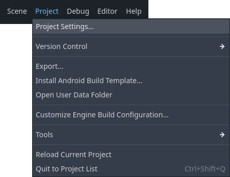
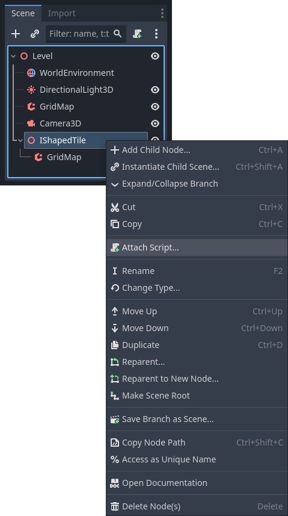

# Créer une première tuile

Sous le nœud racine, ajouter un `Node3D`.
Mettre 0.1 pour l'ordonnée (coordonnée y).
Changer le nom du nœud pour `IShapedTile`.

Ajouter une `GridMap` à `IShapedTile`.
Configurer la `GridMap` comme précédemment (mesh library, cell, ).
Remplir les cellules comme sur la capture ci-dessous :


Nous allons maintenant programmer la réaction de la tuile aux actions du joueur.
La première étape est de mapper des actions sur des événements.

Dans la barre de menu, cliquer sur _Project_ > _Project Settings..._.



Afficher l'onglet _Input Map_.


Dans le champ _Add New Action_ entrer `move_left` et valider avec la touche Entrée.


Cliquer sur le bouton _+_. 


Appuyer sur la touche Flèche gauche du clavier (ou tout autre touche appropriée) puis cliquer sur le bouton _OK_.


Répéter ces étapes pour mapper la touche Flèche droite sur l'action `move_right`, Flèche haut sur `move_up`, Flèche bas sur `move_down` et Clic droit sur `rotate`.
Enfin, fermer la boite de dialogue en cliquant sur le bouton _Close_.


Avec le bouton droit de la souris, cliquer sur le nœud IShapedTile > _Attach Script..._.



Remplacer le nom du script par `Tile.gd`.


L'éditeur 3D est remplacé par l'éditeur de script.


Remplacer le code proposé par celui ci-dessous.

```python
extends Node3D


# Called every frame. 'delta' is the elapsed time since the previous frame.
func _process(delta):
	if Input.is_action_just_pressed("move_left"):
		translate(Vector3.LEFT)
	if Input.is_action_just_pressed("move_right"):
		translate(Vector3.RIGHT)
	if Input.is_action_just_pressed("move_up"):
		translate(Vector3.FORWARD)
	if Input.is_action_just_pressed("move_down"):
		translate(Vector3.BACK)
	if Input.is_action_just_pressed("rotate"):
		rotate_y(deg_to_rad(90))

```


Tester le jeu.
Pourquoi la rotation ne fonctionne-t-elle pas on le voudrait ?
Une fois le problème résolu, créer les 2 dernières tuiles (si vous êtes en panne d'inspiration, j'ai appelé les miennes `LShapedTile` et `CornerShapedTile`).
Que se passe-t-il quand le joueur agit ?