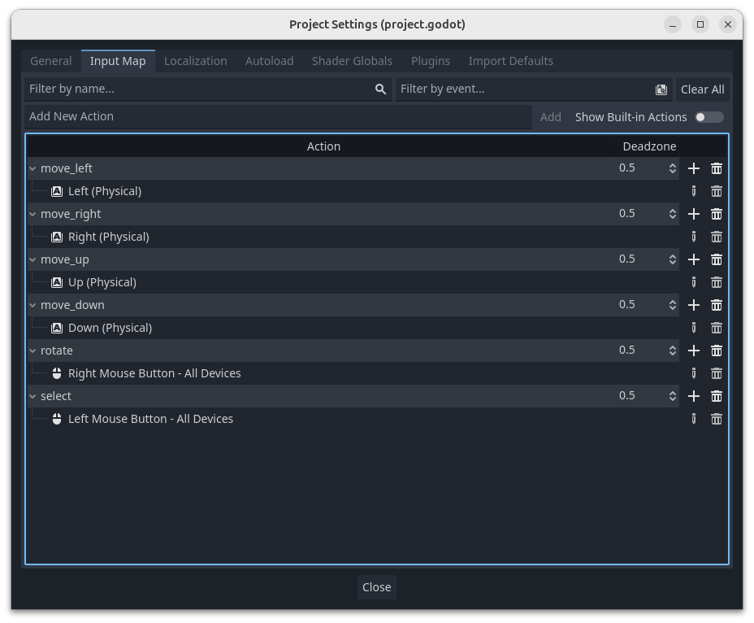
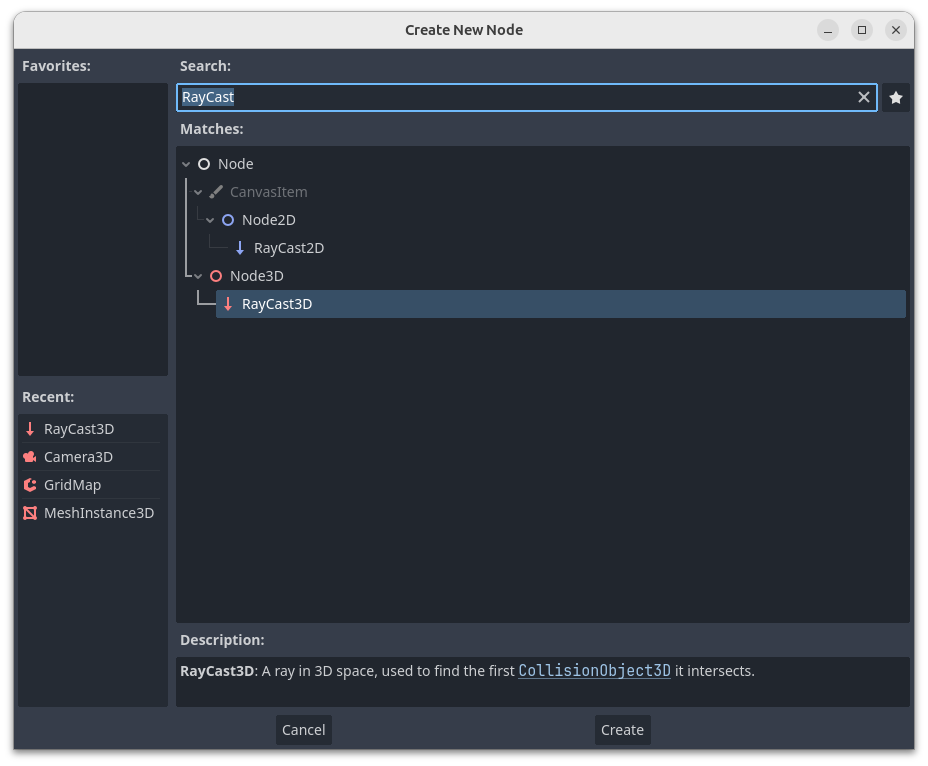
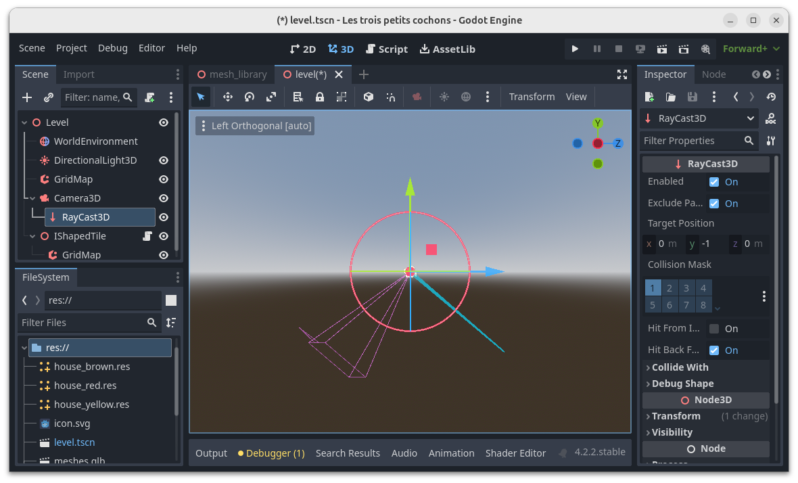
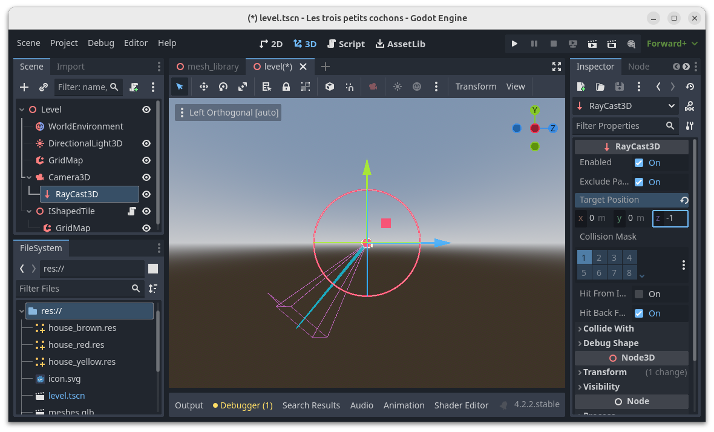
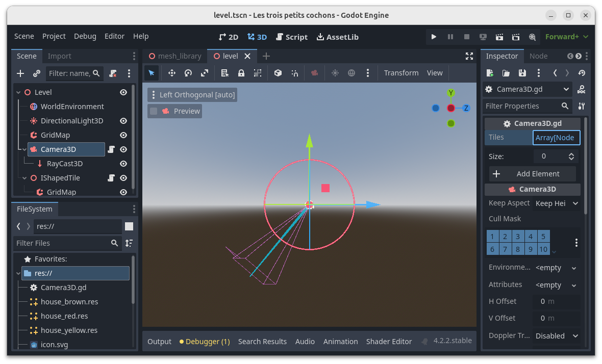

# Sélectionner une tuile

Le joueur doit être en mesure de sélectionner une tuile.
Dans l'onglet _Input Map_ des _Project Settings_, ajouter une action `select` et mapper le clic gauche de la souris dessus.



Pour déterminer sur quel tuile le joueur à cliqué, nous allons utiliser le concept de lancer de rayon.

Ajouter un nœud _RayCast3D_ à la caméra.



Comme le montre la capture d'écran ci-dessous, le rayon configuré par défaut ne part pas dans la bonne direction.



Dans l'inspecteur de propriétés, modifier la _Target Position_ : y passe à 0 et z à -1.



Ajouter le script ci-dessous à la caméra.

```python
extends Camera3D

@onready var ray_cast_3d = $RayCast3D

@export var tiles: Array[Node3D]

# Called every frame. 'delta' is the elapsed time since the previous frame.
func _process(_delta):
	var mouse_position: Vector2 = get_viewport().get_mouse_position()
	ray_cast_3d.target_position = project_local_ray_normal(mouse_position) * 100.0
	ray_cast_3d.force_raycast_update()
	if ray_cast_3d.is_colliding():
		var collider = ray_cast_3d.get_collider()
		if Input.is_action_just_pressed("select"):
			if collider is GridMap:
				var parent = collider.get_parent_node_3d()
				for tile in tiles:
					tile.enabled = (tile == parent)
```

Ce script exporte la variable `tiles`, et pour fonctionner, il aura besoin que le script `Tile.gd` exporte lui aussi une propriété `enabled` de type `bool`.

Ce mécanisme fait apparaître une propriété dans l'inspecteur de propriété de la caméra et permet de configurer la caméra dans le contexte d'une scène.



Dans l'inspecteur de propriétés, ajouter les 3 tuiles dans le tableau _Tiles_.

TODO
