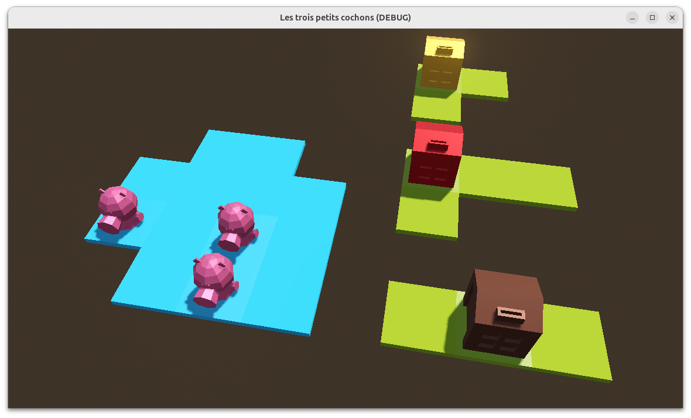

# Introduction

N'en avez-vous pas marre de développer des sites vitrine vantant les qualités de la marque, des applications métier toujours plus critiques, des tâches périodiques faisant toujours circuler davantage de données, des tableaux de bord permettant de prendre des décisions toujours meilleures  ?
Et si, pour une fois, nous mettions nos compétences à profit, le temps d'un atelier, pour apporter comme disait la pub, _quelques grammes de finesse dans un monde de brute_ ?
Pour développer un jeu vidéo ?
Alors rien de fou évidemment ; certainement pas les prochains _Portal_ ou _Undertale_.
Quelque chose de très modeste, juste pour découvrir, comme un jeu de société pour les tous petits, _Les trois petits cochons_ inspirés du célèbre conte.
Et tout ça, avec le moteur de jeux Godot.

