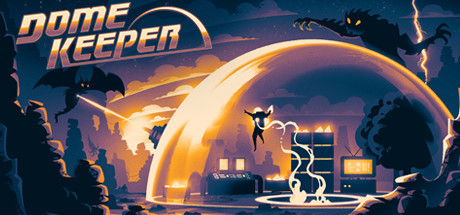
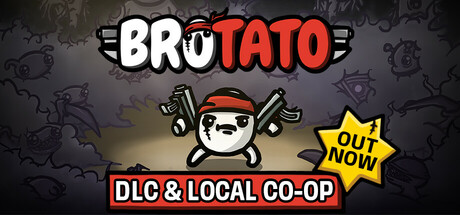

# Godot

Godot est un moteur de jeu multiplateforme permettant de développer des jeux vidéo 2D et 3D. C'est un logiciel libre depuis janvier 2014 qui gagne de plus en plus en popularité, surtout depuis la polémique suscitée par le changement du modèle de licence d'Unity en 2023.

Godot supporte 2 langages de programmation :

- GDScript, dont la syntaxe est très proche de Python
- C#

Grâce à la technologie [GDExtension](https://docs.godotengine.org/en/stable/tutorials/scripting/gdextension/what_is_gdextension.html), d'autres langages sont supportés, au travers de projets communautaires, parmi lesquels C++, Go, Haxe et Rust.

Godot a permis la parution de jeux commerciaux, parmi lesquels [Dome Keeper](https://store.steampowered.com/app/1637320/Dome_Keeper/) et [Brotato](https://store.steampowered.com/app/1942280/Brotato/).

