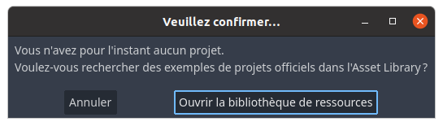
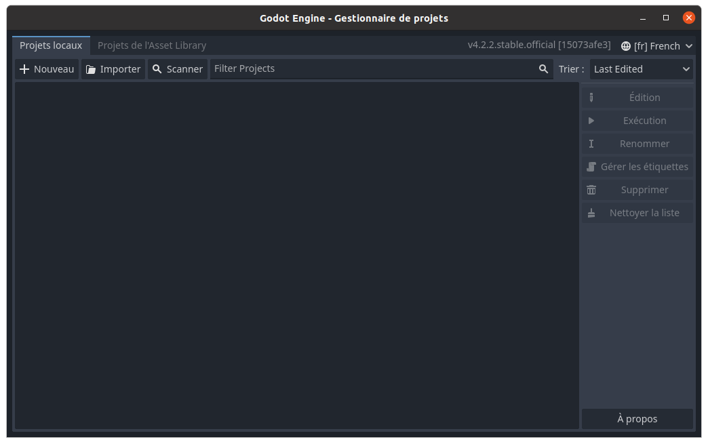
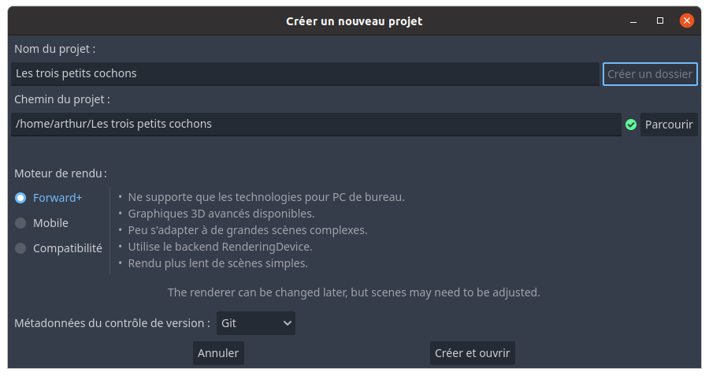
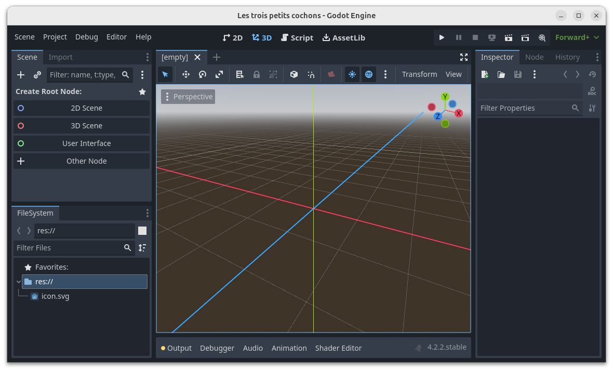
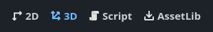
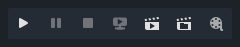
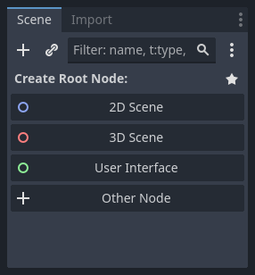

# Créer le projet

## Gestionnaire de projets

Une fois installé, lancer Godot en double-cliquant sur l'exécutable (`Godot_v4.3-stable_win64.exe` sous Windows, `Godot_v4.3-stable_linux.x86_64` sous Linux, etc.).

La première fois, une boite de dialogue propose d'ouvrir la bibliothèques de ressources, mais nous n'en avons pas besoin.
Cliquer sur le bouton _Annuler_. 

Le gestionnaire de projets permet de choisir le projet sur lequel travailler.
Cliquer sur le bouton _Nouveau_ pour créer un nouveau projet.

Nommer le projet `Les trois petits cochons`.
Dans le champ _Chemin du projet_ sélectionner un dossier vierge.
Cliquer sur le bouton _Cliquer et ouvrir_.

La fenêtre de Godot peut être un peu intimidante.
Avant de commencer à la détailler, donnons-nous un peu de vocabulaire.

## Vocabulaire

Une **scène** est un composant.
Ce peut être un niveau, un personnage, un item, un élément de l'interface utilisateur ou encore quelque chose d'abstrait, comme une caméra.
Le développeur doit planifier soigneusement le découpage du jeu en scènes.

Une scène a un **nœud** racine unique, sous lequel plusieurs autres nœuds peuvent être ajoutés.
La connaissance des nombreux types de nœuds proposés par Godot permet de faire les bons choix de composition pour créer les scènes du jeu.

Un **script** désigne un fichier en GDScript ou en C#, attaché à un nœud, qui en spécialise le comportement.

Un **transform** donne les propriétés spatiales d'un nœud en termes de position, de rotation et de taille, dans un **repère de coordonnées**.

Un **mesh** est un modèle 3D.

Un **material** représente l'ensemble des caractéristiques qui permettent à un moteur de rendu de déterminer l'apparence d'une surface : couleur, réflexion, émission...

Revenons maintenant à l'interface de Godot.

## L'interface de Godot

Le milieu de la barre de menu permet de changer d'éditeur.

L'éditeur affiché au milieu de l'écran est l'éditeur 3D.
Pour un jeu en 3D on jongle fréquemment entre l'éditeur 3D et l'éditeur de script.
L'éditeur 2D peut également servir, notamment pour concevoir l'interface utilisateur du jeu.

La partie droite de la barre de menu affiche les boutons permettant de contrôler l'exécution du jeu.
Nous utiliserons principalement les boutons _Run Project (F5)_ et _Stop Running Project (F8)_.

Le panneau en haut à gauche permet de choisir le nœud racine de la première scène du jeu.
Sélectionner _3D Scene_.

