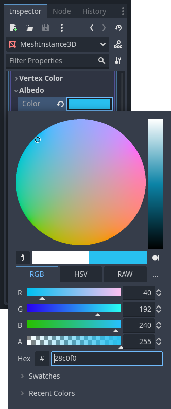

# Créer une mesh library

Il existe de très nombreuses manières différentes pour développer notre jeu.
Nous allons nous appuyer principalement sur le concept de [grid map](https://docs.godotengine.org/en/stable/tutorials/3d/using_gridmaps.html), qui nous sera très pratique pour concevoir le plateau de jeu et les tuiles manipulées par le joeur.
Pour fonctionner, une grid map a besoin d'une [mesh library](https://docs.godotengine.org/en/stable/classes/class_meshlibrary.html#class-meshlibrary).
Celle-ci contient le catalogue des modèles 3D disponibles pour peupler les éléments d'une grille.
Ces modèles seront importés pour partie depuis un fichier GLB réalisé avec [Blender](https://www.blender.org/) ou générés directement dans Godot.

## Importer les modèles 3D dans Godot

Depuis un explorateur de fichiers, copier le fichier `meshes.glb` dans le dossier du projet.
De retour dans Godot, le fichier est détectée et une fugace barre de progression s'affiche, signalant l'importation.

Un fichier GLB contient entre autres des modèles 3D.
Bien qu'il puisse l'explorer, Godot ne peut pas utiliser le fichier directement.
Depuis Godot, double-cliquer sur `meshes.glb` dans l'explorateur de ressources, en bas à gauche de la fenêtre. 

Cliquer sur l'onglet _Meshes_ pour explorer les modèles 3D à l'intérieur du fichier GLB.

Il faut exporter chaque mesh dans un format compatible avec Godot.
Pour chacun, cocher la case _Enabled_ sous _Save to file_.
Cela fait apparaître la propriété _Path_.
Cliquer sur l'icône en forme de dossier et nommer le fichier exporté.
Par exemple `house_red` pour la maison rouge.  

Lorsque tous les meshes ont été configurés pour l'importation, cliquer sur le bouton _Reimport_.

4 nouveaux fichiers RES font leur apparition dans l'explorateur de ressources.

## Créer un mesh simple

Dans l'explorateur de scène, cliquer avec le bouton droit de la souris sur le nœud racine et sélectionner _Add Child Node..._.

Dans le champ de recherche, entrer `MeshInstance`.
Double-cliquer sur _MeshInstance3D_.

L'inspecteur à droite de l'écran affiche les propriétés de la MeshInstance3D.

Cliquer sur la valeur `<empty>` du champ _Mesh_.
Dans la liste déroulante, sélectionner _New BoxMesh_.

Un cube apparaît comme valeur du champ _Mesh_.
Cliquer dessus pour afficher l'éditeur de propriété du modèle 3D.
Reduire la hauteur à 0.1 (y correspond à l'axe vertical dans Godot).

Cliquer sur la valeur `<empty>` du champ _Material_.
Sélectionner _New StandardMaterial3D_.

Cliquer sur la sphère qui apparaît dans le champ _Material_.
Dans les propriétés du matériau, développer _Albedo_.
Cliquer sur _Color_.
Pour le bleu du plateau de jeu, j'ai choisi la couleur `#28c0f0`.

Dans la barre d'outils au-dessus de l'éditeur 3D, cliquer sur le bouton _Mesh_, puis _Create Trimesh Static Body_.

Dans l'explorateur de scène, double-cliquer sur le MeshInstance3D pour le renommer en `Empty`.

Reprendre les étapes ci-dessus pour créer un deuxième mesh, cette fois-ci avec la couleur `#96b41e` et le nom `Grass`.

## Créer un mesh à partir d'un fichier RES

Sous le nœud racine, créer un nouveau nœud `MeshInstance3D`.
Cliquer sur `<empty>` en face du champ _Mesh_.
Sélectionner _Quick Load..._

Dans la boite de dialogue qui s'affiche, sélectionner `house_brown.res`.
Dans la barre d'outils au-dessus de l'éditeur 3D, cliquer sur le bouton _Mesh_, puis _Create Trimesh Static Body_.
Renommer le MeshInstance3D en `Brown House`.

Répéter ces étapes pour créer les modèles pour `Red House`, `Yellow House` et `Pig`.

## Exporter la scène sous forme de mesh library

Renommer le nœud racine en `Mesh Library` et sauver la scène (Ctrl + S).
Puis, dans la barre de menu, cliquer sur _Scene_ > _Export As..._ > _Mesh Library..._

Entrer le nom `mesh_library` et cliquer sur le bouton _Save_.

