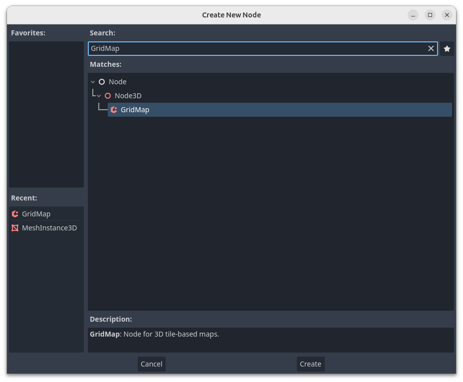
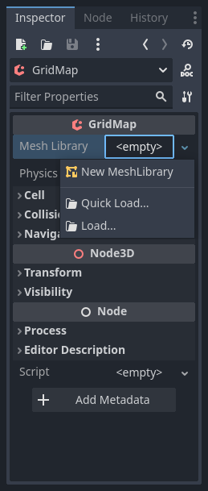
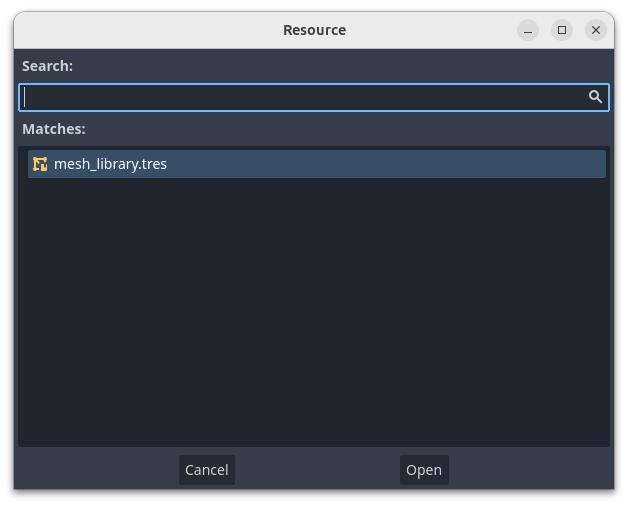
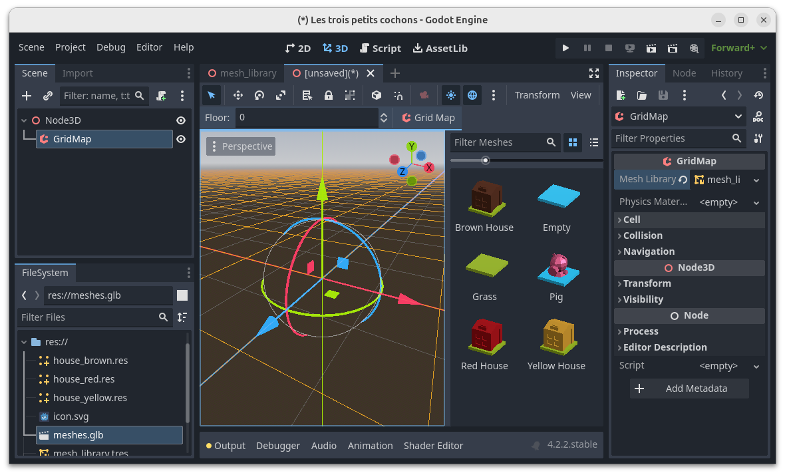
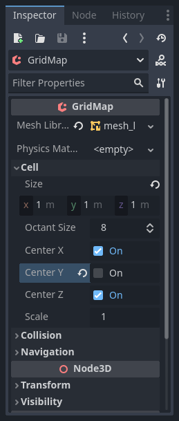
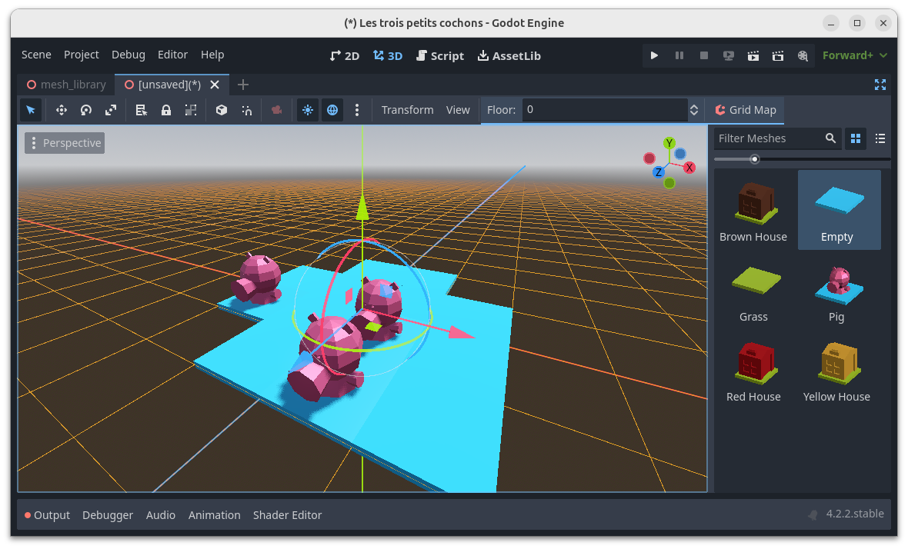

# Construire le plateau de jeu

Créer une nouvelle scène (Ctrl + N, ou menu _Fichier_ > _New Scene_).
sélectionner _3D Scene_ comme nœud racine.
Sous le nœud racine, ajouter une _GridMap_.

Dans l'inspecteur de propriétés, cliquer sur la valeur `<empty>` en face du champ _Mesh Library_.
Sélectionner _Quick Load..._

Dans la boite de dialogue, double-cliquer sur le fichier `mesh_library.tres`. 

L'éditeur 3D affiche le contenu de la mesh library sur sa partie droite. 

Dans l'éditeur de propriétés, développer _Cell_.
Reduire la taille des cellules de la grille à 1 m dans toutes les directions et décocher la case _Center Y_.

La construction du plateau se fait dans la partie gauche de l'éditeur et nécessite de naviguer dans la scène.
Bien que Godot propose plusieurs mécanismes, nous nous limiterons à décrire les possibilités offertes par la molette de la souris :

- Faire tourner la molette permet de zoomer
- Glisser-déposer permet de changer l'angle de vue
- Shift + glisser-déposer permet de déplacer l'objectif dans la scène

Le clic gauche permet de sélectionner le mesh dans la palette et de l'instancier dans une cellule de la grille.
Le clic droit, quant à lui, permet de supprimer l'instance.

Renommer le noœud racine `Level`, puis sauver la scène.