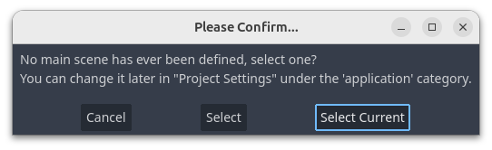
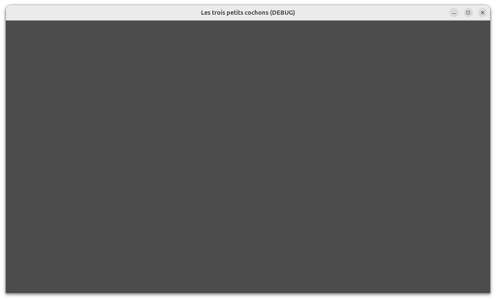
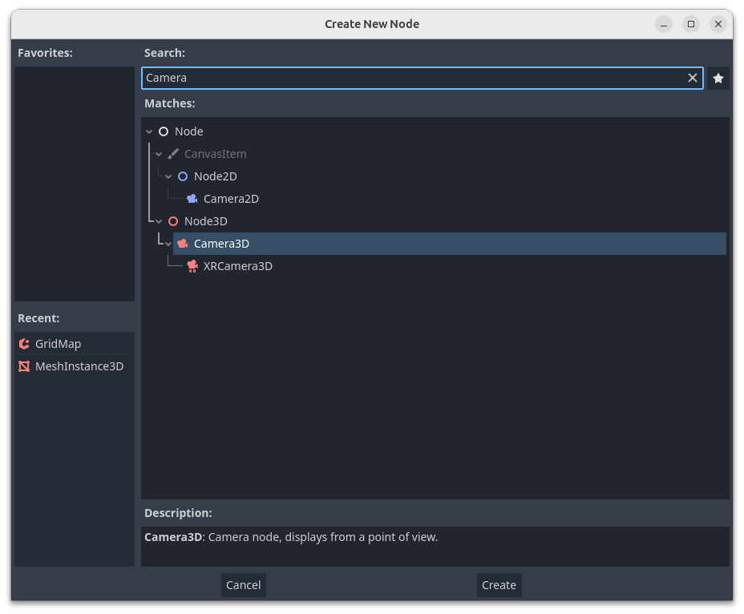
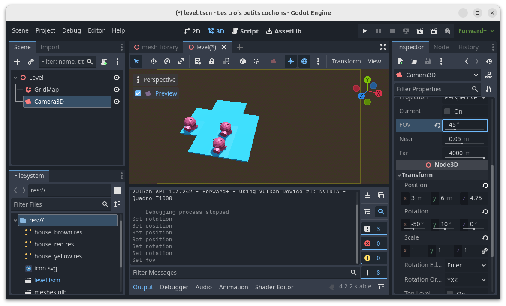
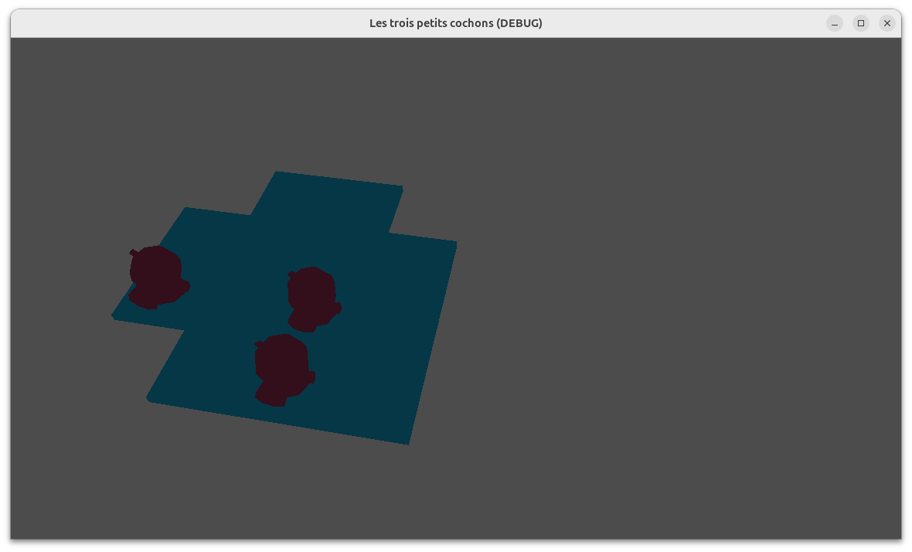
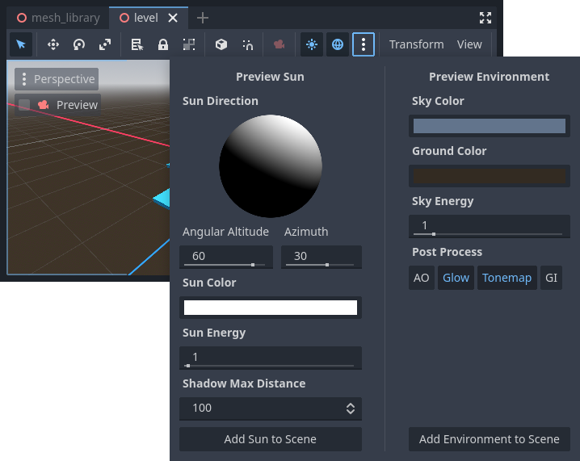
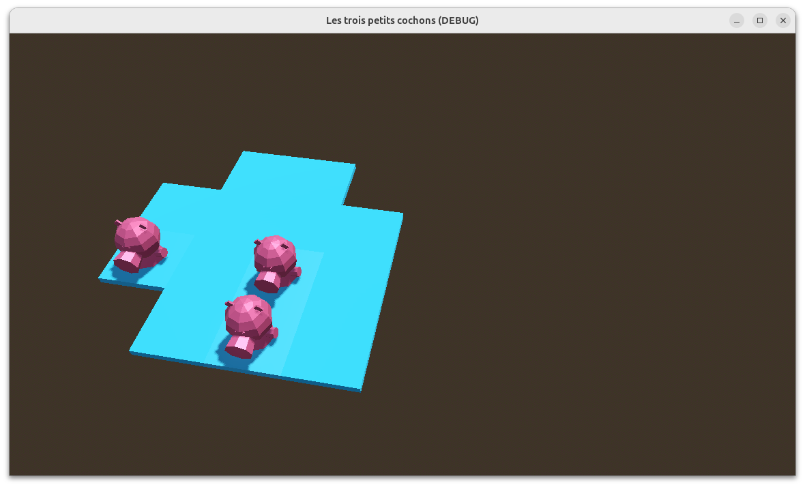

# Premier lancement

Cliquer sur le bouton _Run Project_.
Comme aucune scène n'a été définie comme scène principale du projet, Godot affiche une fenêtre de dialogue.
Cliquer sur le bouton _Select Current_.

La fenêtre de jeu s'affiche mais il n'y a rien !
Comment est-ce possible ?

Les moteurs de jeu empruntent au cinéma leur concept de caméra pour définir le point de vue du joueur.
Ce concept est tellement important qu'il sert parfois à qualifier le genre d'un jeu : FPS, TPS, etc.

Dans Godot, la caméra est, à l'instar de la grid map, un nœud dans une scène.
Sous le nœud Level, ajouter une _Camera3D_.

Dans l'inspecteur de propriétés de la caméra, développer _Transform_ et modifier la position et la rotation de la caméra.
On peut aussi utiliser le gizmo pour modifier ces paramètres avec le clic gauche de la souris.

J'ai aussi modifié le FOV pour réduire l'effet de déformation de l'image, mais ici, chacun est libre.

La case à cocher _Preview_ qui apparaît dans l'angle supérieur gauche de l'éditeur 3D permet de voir avec l'œil de la caméra.

Lancer le jeu.
Alors que l'image est intéressante à regarder dans l'éditeur, elle est terne et sans relief dans le jeu.
Pourquoi ?

Il manque un environnement et une lumière.
En phase de prototypage, Godot permet de créer ces 2 nœuds très rapidement.
Dans la barre d'outils de l'éditeur 3D, cliquer sur le bouton _Edit Sun and Environment settings._ (l'icône représentant 3 points en colonne).
Ajouter tour à tour un soleil (bouton _Add Sun to Scene_) et un environnement (bouton _Add Environment to Scene_).

Lancer le jeu.
C'est beaucoup mieux !

